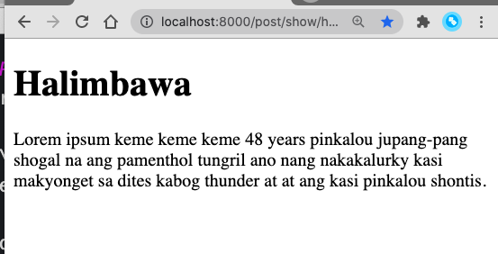

# PalalaPHP

Yet another blog based on markdown.

## What it is NOT

- It is not a static site generator

## What is it for?

- Sites with html content (ie blogposts, personal wikis, knowledgebase, FAQ, news sites)
- If you need to be able to add site contents to version control. 
- If you have a server that can render with PHP
- Sensible default components - nav, contact form, order form (for simple order X sites)

## Who is it intended for?

- PHP developers who need a static-like website but have the option to use PHP in the code. 
- People who like markdown, and like PHP, and want to use both in a website 

## Why use this, this is similar to jigsaw. 

Yes, there are static generators like jigsaw and sculpin, and then those can be deployed on netlify or vercel.

My main reason fo rmaking this is  to be  customizable as possible and as simple as possible, the average non-Laravel or non-static site user can still understand how to use it, and grok how it works.

## I'd rather use X

I don't mind. This is a simple project to test out an idea. 

## Why are you not using Laravel!??

I could have used Laravel, but the feeling is you need to keep updating it to have an active project. So far, symfony versions don't change as frequently as laravel, so the feeling of needing to upgrade to latest is not as often as from laravel.

## Learnings

I'm posting resources that helped me build this on the [TIL.md](TIL.md) file.

## Screenshots

